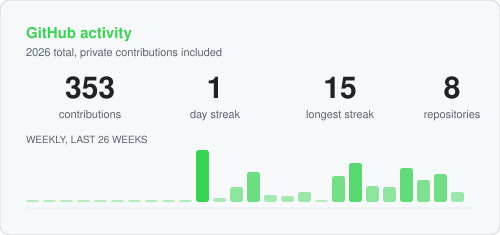
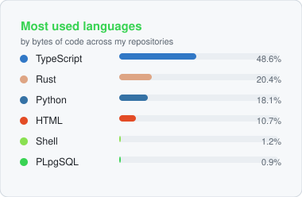

<picture>
  <source media="(prefers-color-scheme: dark)" srcset="assets/header-dark.svg">
  
</picture>

  

---

## About

- **Cybersecurity student at SETU** (South East Technological University)
- Into **security, networking and reverse engineering** — Wireshark, Ghidra and Burp Suite are my playground
- I like **taking things apart** to find out how they actually work, rather than how the docs say they work
- **Strong team player** — I enjoy building things with people and pulling my weight in a group
- I take every opportunity I can get, and there is always a side project running
- Levelling up and shipping — **more coming soon**

---

## Tech & tools

**Languages**

**Security & networking**

**Build, run, automate**

**Systems**

---

## Activity

  <picture>
    <source media="(prefers-color-scheme: dark)" srcset="assets/stats-dark.svg">
    
  </picture>
  <picture>
    <source media="(prefers-color-scheme: dark)" srcset="assets/langs-dark.svg">
    
  </picture>

These cards are rebuilt daily and committed here, so GitHub
serves them itself — no third-party card service that can rate-limit and leave a broken image
behind, and nothing to refresh by hand.

---

Reach me on LinkedIn, or open an issue here.

